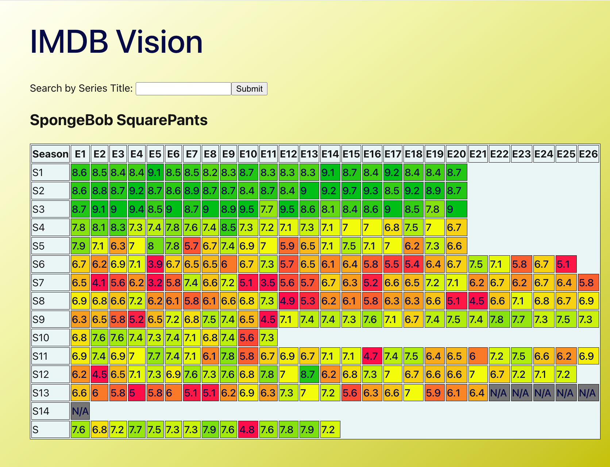

# IMDB TV Show Rating Visualizer



## Starting the Frontend
```
cd imdb_vision_frontend
npm run dev
```

## Starting the Backend
```
cd imdb_vision_backend
flask run
```

## Where the data comes from
IMDB has non-commercial datasets available [here](https://developer.imdb.com/non-commercial-datasets/)

Data is refreshed daily

## To download the latest datasets
```
cd imdb-vision-backend/datasets
./get_datasets.sh
```
The datasets will be downloaded into the folder

## To create the database
From the backend folder:
`flask db upgrade head`

### To seed data to the database
Make sure the dataset TSV files are downloaded.

From the backend folder:
`python seed.py`